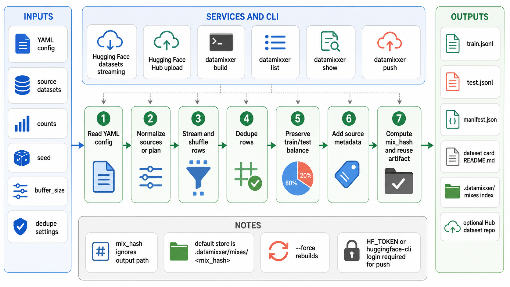

<div align="center">
  

  **🧪 Deterministic balanced dataset mixes 🧪**
</div>

`datamixxer` is a Python CLI for building balanced subsamples from Hugging Face
datasets. It reads a YAML config, streams each source split, shuffles
deterministically, deduplicates rows, and writes a versioned dataset mix.

Each build produces JSONL split files, `manifest.json`, and a dataset card. When
a test split is configured, each source bucket is split independently so train
and test keep the same blend.

## Install

```bash
uv sync
```

Create a config for a first source, run the combined preflight check, preview
the mix, then build:

```bash
uv run datamixxer new my_mix.yaml --dataset HuggingFaceTB/smoltalk2 --dataset-config SFT --split train --count 1000
uv run datamixxer doctor my_mix.yaml --sample-rows 3
uv run datamixxer plan my_mix.yaml
uv run datamixxer build my_mix.yaml
uv run datamixxer publish my_mix.yaml --repo-id owner/my-balanced-mix-v1
```

To discover valid dataset configs and splits before editing YAML:

```bash
uv run datamixxer inspect HuggingFaceTB/smoltalk2
```

## Config

```yaml
id: my_balanced_mix
name: My Balanced Mix
version: v1
seed: 3407
buffer_size: 10000
dedupe: true

split:
  test_size: 0.1

tagging:
  - rate: 0.2
    output_splits: [train]
    tags:
      restyle: true
      target_style: plain

sources:
  - name: math
    dataset_id: org/math-dataset
    config: default
    split: train
    count: 1000
  - name: code
    dataset_id: org/code-dataset
    split: train
    count: 1000
    metadata:
      domain: code

output:
  store_dir: .datamixxer/mixes
  train_file: train.jsonl
  test_file: test.jsonl
  push_to_hub: false
  hub: {}
```

Required fields:

- `id`: stable artifact id used in manifests and default repo naming.
- `sources`: non-empty list of source buckets.
- Source `dataset_id`: Hugging Face dataset id.
- Source `split`: Hugging Face split name to stream.
- Source `count`: positive row count.

Common optional fields:

- `name`: human-readable dataset mix name.
- `version` or `artifact_version`: artifact version. Numeric values are normalized with `v`.
- `seed`: base shuffle seed. Defaults to `3407`.
- `buffer_size`: streaming shuffle buffer. Defaults to `10000`.
- `split.test_size`: fraction, percentage, or row count for each bucket's test split.
- `tagging`: deterministic row tagging rules applied after the mix is built.
- Tagging `rate`: fraction, percentage, or row count per balanced group.
- Tagging `output_splits`: optional output split filter such as `[train]`.
- Tagging `balance_by`: optional provenance fields. Defaults to
  `source_dataset`, `source_config`, `source_split`, and `output_split`.
- Tagging `tags`: mapping added to selected rows, for example `restyle: true`.
- `dedupe`: `true`, `false`, a field path such as `messages`, or a mapping with `field`/`fields`.
- Source `config`: dataset config/subset name.
- Source `metadata`: mapping copied into every output row for that source.
- `output.store_dir`: local artifact store. Defaults to `.datamixxer/mixes`.
- `output.train_file` and `output.test_file`: output JSONL filenames.
- `output.push_to_hub`: whether `build` should upload by default.
- `output.hub.repo_id` or `output.hub.owner`: Hub target for publishing.
- `output.hub.private`: create or update the target Hub repo as private.
- `output.hub.commit_message`: Hub upload commit message.
- Source `train_count` and `test_count`: advanced alternative to `count` plus `split.test_size`.
- Source `restyle`: legacy compatibility flag copied into every row from that source.

The older shared-source shape used by `llmstyler` is still supported for
existing configs, but new configs should use `sources`:

```yaml
source:
  dataset_id: HuggingFaceTB/smoltalk2
  config: SFT
plan:
  - name: capability_magpie
    split: smoltalk_smollm3_smol_magpie_ultra_no_think
    count: 300
    restyle: false
```

## Commands

```bash
uv run datamixxer init my_mix.yaml                                         # write starter config
uv run datamixxer init my_mix.yaml --empty                                 # write a config without placeholder sources
uv run datamixxer new my_mix.yaml --dataset org/data --split train         # write a valid one-source config
uv run datamixxer inspect HuggingFaceTB/smoltalk2                          # list dataset configs and splits
uv run datamixxer add-source my_mix.yaml --name math --dataset org/math --split train --count 1000
uv run datamixxer doctor my_mix.yaml --sample-rows 5                       # validate shape, source access, and sample rows
uv run datamixxer validate my_mix.yaml                                     # validate config shape
uv run datamixxer validate my_mix.yaml --check-sources                     # validate config and source access
uv run datamixxer validate my_mix.yaml --sample-rows 5                     # catch row-schema issues such as bad dedupe fields
uv run datamixxer plan my_mix.yaml                                         # preview composition, hash, and output path
uv run datamixxer plan my_mix.yaml --sample-rows 3                         # preview composition and row examples
uv run datamixxer sample my_mix.yaml --rows 3                              # preview row schemas and examples
uv run datamixxer plan my_mix.yaml --explain-hash                          # preview composition and hash inputs
uv run datamixxer build my_mix.yaml                                        # build locally
uv run datamixxer build my_mix.yaml --push-to-hub                          # build and upload
uv run datamixxer list                                                     # list local mixes
uv run datamixxer show my_mix.yaml                                         # inspect the built mix or preview the config
uv run datamixxer publish my_mix.yaml --repo-id owner/name                 # upload a built mix
uv run datamixxer publish my_mix.yaml --repo-id owner/name --check         # check Hub auth/repo access
uv sync --extra dev                                                        # install test/lint tools
uv run pytest                                                              # run tests
uv run ruff check .                                                        # run lint checks
```

`push` and `hub-check` are kept as hidden compatibility aliases. Prefer
`publish` and `publish --check` for new workflows.

## Notes

- `mix_hash` is computed from sampling inputs: sources, counts, train/test
  balance, seed, buffer size, dedupe settings, and output-affecting source
  metadata.
- Output paths and Hub settings do not affect `mix_hash`. If a complete mix with
  the same hash already exists, `build` reuses it unless `--force` is passed.
  Use `plan --explain-hash` to inspect the normalized hash inputs.
- Local mixes are stored under `.datamixxer/mixes/<mix_hash>` by default.
  `output.store_dir` controls where `build` writes artifacts and where `list`
  and `show` look for them.
- Each output row keeps the source row fields and adds `bucket`,
  `source_dataset`, `source_config`, `source_split`, `output_split`, and any
  per-source `metadata`.
- Tagging rules use those provenance fields to select an exact deterministic
  share of rows per group. Use `output_splits: [train]` to tag only train rows.
- Hub uploads require `HF_TOKEN` or `hf auth login` before using
  `--push-to-hub` or `datamixxer publish`. Use `doctor --push-to-hub` or
  `publish --check` before a long build to verify authentication and target repo
  access. The check is non-mutating; upload commands create the target repo when
  needed.
- Streaming commands close source iterators after collecting the requested rows
  and suppress Hugging Face progress bars; datamixxer prints one progress stream
  per source bucket.
- `validate` catches shape errors and unedited starter placeholders. Add
  `--check-sources` to verify that every configured Hugging Face
  dataset/config/split can be reached before starting a streaming build.
- `plan` prints a copy-friendly `Short hash`; add `--sample-rows` for row
  examples or `--explain-hash` to print the full hash and normalized hash inputs.

## Common Errors

- `Config has setup items to fix`: replace starter placeholders such as
  `owner/dataset-name`, remove `config: default` when the dataset has no config,
  and set a real Hub repo before publishing. To avoid placeholders entirely, use
  `datamixxer new ...` or `datamixxer init --empty`.
- `count must be greater than 0`: every source must request at least one row.
- `dedupe field ... was not found`: run `validate --sample-rows 5` to catch row
  schema mismatches before a full build, then change `dedupe.field` or disable
  dedupe for that mix.
- `No built mix exists for my_mix.yaml`: run `datamixxer build my_mix.yaml`
  before `datamixxer publish my_mix.yaml`.

## Architecture



## License

No license file is present in this repository yet.
